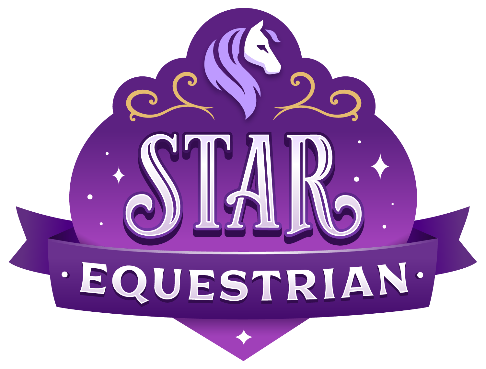

# Star Equestrian Map (WIP)

An interactive map for [Star Equestrian](https://www.foxieventures.com/star-equestrian/).

Shoutout to the awesome folks at Foxie Ventures who provided me with a large map image. Thanks, @Random Spider!

## Features

- Filter markers by type
- Filter food items by stat
- Mark items as collected (markers for items that respawn reset at midnight UTC)
- Mark items that haven't respawned yet
- Progress indicators for collectibles
- No data collected. Everything is stored in your browser's storage.

---

This is an unofficial fan-made project. Game, logo, and all imagery &copy; [Foxie Ventures](https://www.foxieventures.com).

**Credits:**

- [MapTiler Engine](https://www.maptiler.com/engine/)
- [Svelte](https://svelte.dev)
- [Leaflet](https://leafletjs.com)
- [Leaflet.SidePanel](https://github.com/maxwell-ilai/Leaflet.SidePanel)
- [Shoelace](https://shoelace.style)